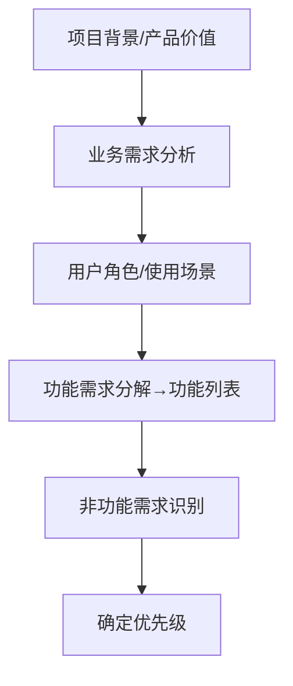
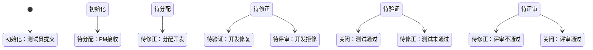

以下是对《Lecture 2 (Software Testing Practice).pdf》的**完整、详细笔记整理**，**逐页、逐节**覆盖所有内容，保留原文结构逻辑，同时提炼精要、归类清晰，便于深度复习、项目实践参考或知识体系构建。

---

# 📘《软件测试实践》完整笔记整理  
**授课教师**：单纯（sherryshan@bit.edu.cn）  
**时间**：2025年11月  
**讲义日期**：2025年12月3日  

---

## 一、引言：软件测试实践的意义  
> **核心观点**：  
> 软件测试方法与技术必须通过**工程项目实践**来检验；测试员能力提升依赖于**持续的项目实战经验积累**。

---

## 二、内容概览（共7大模块）
1. 组建测试团队  
2. 测试需求分析与测试计划  
3. 设计和维护测试用例  
4. 部署测试环境  
5. 报告所发现的缺陷  
6. 软件测试和质量分析报告  
7. 软件测试项目管理  

---

## 1️⃣ 组建测试团队  

### 1.1 测试团队的地位和责任  
#### 1.1.1 软件测试团队的任务  
✅ **基本责任**  
- 发现软件程序/系统/产品中**所有问题**  
- **尽早**发现问题（Shift-Left）  
- 督促开发人员**及时修复缺陷**

✅ **延伸责任**  
- 协助项目经理制定**合理开发计划**  
- 对缺陷进行**分析、分类、总结、跟踪**，使管理者清晰掌握当前质量状况  
- 推动**开发流程优化**、提升开发效率  
- 督促提升代码的**规范性、可读性、可维护性**

#### ▶️ 测试团队地位与组织关系（3类典型模型）  
| 类型 | 特点 | 优劣 |
|------|------|------|
| **以开发为核心** | 测试团队隶属开发部门 | 缺乏独立性，易受进度压力影响质量判断 |
| **以项目经理为核心** | 测试与开发为平行团队，向PM汇报 | 协调性强，但可能弱化专业性 |
| **三国鼎立**（推荐） | 开发、测试、PM三权分立，测试独立向质量VP或QA总监汇报 | 保证测试客观性，利于质量文化建设 |

#### 1.1.2 测试团队的规模  
📌 规模依据：  
- 单项目：按测试范围评估工作量  
- 多项目/长期部门：考虑预算、产品路线图、项目并行/重叠、延期风险 → **预留10%~20%缓冲（Buffer）**

📌 行业常见测试:开发比例  

| 产品类型 | 比例（测试:开发） | 说明 |
|----------|------------------|------|
| 操作系统类（如Windows, Linux） | **2:1** | 安全性、稳定性要求极高 |
| 应用平台/支撑系统（如中间件、数据库） | **1:1** | 复杂度高，集成面广 |
| 特定应用类产品（如内部OA、行业APP） | **1:2 ~ 1:4** | 用户明确、场景有限、环境受限 |

---

### 1.2 测试团队的构成  

#### 1.2.1 基本构成（角色+职责）  
| 角色 | 主要职责 |
|------|----------|
| **QA/测试经理** | 人员管理、资源调配、流程改进、部门建设 |
| **实验室管理员** | 搭建/配置/维护测试环境（网络、服务器、权限） |
| **内审员** | 审查流程、建立模板、跟踪缺陷报告质量 |
| **测试组长** | 负责单项目全过程：计划→用例→任务→报告→分析 |
| **资深测试工程师** | 模块级测试负责人；设计自动化框架；审查PRD/设计/代码；指导初级 |
| **一般（初级）测试工程师** | 执行用例、报告缺陷、功能/验收测试 |

#### 1.2.2 各岗位详细责任（补充说明）

##### 🔹 初级测试工程师  
- 熟悉产品功能/界面  
- 执行测试用例，验证与规格一致性  
- 清晰描述缺陷（含步骤、截图等）  
- 使用简单测试工具（如Postman, Selenium IDE）  
- 接受指导，持续学习

##### 🔹 测试工程师  
- 审查PRD；设计功能测试用例  
- 开发测试脚本；搭建简易测试环境  
- 缺陷全生命周期管理（Report → Track → Verify → Close）  
- 编写测试报告；指导初级工程师

##### 🔹 资深测试工程师  
- 制定模块级**测试计划与策略**  
- 构建自动化框架（如Pytest+Allure+Jenkins）  
- 搭建复杂测试环境（高可用集群、灾备）  
- 设计**非功能测试用例**（性能、安全、故障转移）  
- 代码审查（Code Review）  
- 指导中级工程师

##### 🔹 测试实验室管理员  
- 网络规划与建设（拓扑、防火墙、负载均衡）  
- 服务器/平台部署维护（OS, DB, App Server）  
- 资源登记分配；采购协助；权限/安全策略制定  
- 环境优化（提升网络/服务器性能）

##### 🔹 软件包构建/发布工程师  
- 管理代码库（SVN/Git）；制定check-in/out规范  
- 建立编译/链接自动化脚本（Makefile, Shell, Jenkinsfile）  
- **Daily Build**：确保每日构建可用、无毒、完整  
- 构建包版本校验、存储、分发、备份

##### 🔹 测试组长  
- 主导测试全流程：计划、策略、风险评估、排期  
- 推动缺陷闭环；编写整体测试报告  
- 竞品分析 → 提出改进建议  
- 监督流程执行，反馈问题给经理/PM  
- 技术指导与协调

##### 🔹 测试经理  
- 团队建设：招聘/考核/培训/激励/组织优化  
- 多项目统筹：资源协调、进度跟踪、质量把控  
- 制定**年度/季度计划与预算**  
- 推广质量文化（Quality Culture）  
- 定义/优化**测试流程**（如CI/CD集成点）  
- 主导跨部门需求评审  
- 审核测试计划/报告；组织质量分析  
- 深度竞品分析，支撑产品决策

#### 🌟 案例：一个微软测试工程师的一天  
| 时间 | 活动 |
|------|------|
| 早晨 | 查收**每日构建（Daily Build）** & **BVT结果邮件** |
| 早会前 | 分析BVT失败 → 定位 → 提交**Pri-0 Bug**（当日必须修复） |
| 上午 | 验证已修复Bug → 关闭 → 执行**回归测试**（影响范围） |
| 上午 | 调试新测试脚本 → 修复脚本Bug → 开发新测试规范/脚本 |
| 下午 | 用稳定脚本验新版本 → 尽量发现严重问题 |
| 下午 | 改进自动化系统；参与PRD/用例评审；复审同伴脚本 |
| 全天 | 响应项目问题咨询 |

#### 1.2.3 测试团队组织模型  
| 模型 | 特点 | 适用场景 |
|------|------|---------|
| **按技术领域划分**（如功能、性能、安全、自动化） | 专业化强；技术深度高；跨项目复用资源 | 大型公司、平台型产品（如阿里云、腾讯云） |
| **按产品线划分**（如微信、支付、广告） | 业务理解深；响应快；端到端负责 | 互联网公司、多产品线企业（如字节、美团） |

> ⚠️ 小团队建议：**以项目为单位灵活组织**

---

### 1.3 测试团队的管理和发展  

#### 1.3.1 激励方法  
- **正向激励**：表扬、奖励（物质/荣誉）  
- **支持立场**：站在测试小组一边，为质量发声  
- **提升士气**：认可贡献、庆祝里程碑  
- **支持合理工作方式**：如探索式测试、自动化投入  

#### 1.3.2 知识共享与在岗培训  
- 定期技术分享会（如：缺陷分析会、工具 workshop）  
- 建立内部知识库（Wiki/Confluence）  
- **以老带新**、轮岗锻炼  
- 鼓励参加外部会议/认证（ISTQB, CSTE）

---

## 2️⃣ 测试需求分析与测试计划  

### 2.1 测试的目标和准则  

#### 2.1.1 确定测试目标  
✅ 测试目标 ≠ “找Bug”，而是：  
- 向风险管理提供信息  
- 提供系统质量证据  
- 评估是否满足干系人期望  
- 评估修复/变更是否引入新问题  
- 验证合规性（如GDPR、等保）

📌 **项目级具体目标示例**：  
- 新功能是否正确实现？  
- 是否影响老功能？（回归风险）  
- 功能性/非功能性是否达标？  
- 测试覆盖率目标（如：核心路径100%）  
- 效率目标（如：自动化率提升至70%）

#### 2.1.2 软件测试项目的出入准则（Entry/Exit Criteria）

| 阶段 | 进入准则（Entry） | 退出准则（Exit） |
|------|------------------|------------------|
| 系统测试 | 需求文档评审通过<br>设计文档完成<br>集成测试通过<br>测试环境Ready<br>测试用例Ready | 功能用例通过率 ≥100%<br>非功能用例通过率 ≥95%<br>严重及以上Bug=0<br>**或**：<br>缺陷密度 < m / CPU小时（n个连续区间） |

> 📌 **严格系统**（如医疗、航天）：必须采用**双重退出标准**（用例+缺陷密度）

#### 2.1.3 测试项目管理原则  
- 需求可靠（明确、可测、无歧义）  
- 适配开发模型（Waterfall/Agile/DevOps）  
- **尽早测试** + **充分测试**  
- 合理时间表（避免“测试压缩”）  
- 充分沟通（每日站会、缺陷评审会）  
- 基于数据库的测试管理系统（如Jira, QC, TestRail）

---

### 2.2 测试需求分析  

#### 分析流程（自上而下）  


#### 分析项清单  
- 项目背景  
- 业务流程 & 用户角色  
- 关键用例 & 场景  
- 支撑功能  
- 功能优先级（P0~P3）  
- 非功能特性（性能、安全、兼容性等）

#### 📌 需求层次（三层模型）  
| 层级       | 说明                  | 文档形式            |
| -------- | ------------------- | --------------- |
| **业务需求** | 组织/客户的宏观目标<br>（Why） | 《项目视图与范围文档》     |
| **用户需求** | 用户要完成的任务<br>（What）  | 《用例文档》《用户故事》    |
| **功能需求** | 开发必须实现的功能点<br>（How） | 《SRS 软件需求规格说明书》 |

#### 🔍 非功能需求示例：性能  
| 视角 | 指标 | 示例 |
|------|------|------|
| 用户 | 响应时间 | 2-5-10原则（2s快，5s可接受，10s放弃） |
| 业务 | 吞吐量/容量 | 每秒处理1000笔订单 |
| 技术 | 资源占用 | CPU ≤70%，内存 ≤4G |
| 合规 | 标准要求 | 符合ISO 25010性能效率标准 |

> ✅ **关键**：性能指标必须**可量化**，否则无法测试！

---

### 2.3 测试项目的估算与进度安排  

#### 2.3.1 测试工作量估算影响因素  
| 因素 | 影响趋势 |
|------|---------|
| 测试范围/任务 | ↑范围 → ↑工作量 |
| 需求/设计质量 | ↓质量 → ↑工作量（反复澄清、返工） |
| 代码质量 | ↓质量 → ↑回归测试频次 → ↑工作量 |
| 开发阶段 | 集成/系统测试 > 单元测试 |
| 自动化程度 | ↑自动化 → ↓手工执行成本 |
| 领域/技术难度 | 新技术/复杂协议 → ↑学习/调试成本 |

#### 2.3.2 工作分解结构（WBS）法  
✅ 步骤：  
1. 列出主任务（如：测试计划、用例设计、执行、报告）  
2. 逐层分解到**可估算粒度**（建议：单任务≤2人日）  
3. 编号层级化（如：1.1.2 = 计划→WBS→估算）  
4. 估算每项工时 → 汇总 → 加Buffer

📌 示例：  
```
1. 测试计划  
  1.1 需求分析  
  1.2 风险识别  
  1.3 WBS估算  
    1.3.1 分解任务  
    1.3.2 估算工时  
  1.4 编写测试计划文档  
```

---

### 2.4 测试风险和测试策略  

#### 2.4.1 测试风险管理计划  
✅ **风险识别工具**：**风险检查表**（Checklist）  
✅ **风险控制方法**：  
- 规避（Avoid）：不做高风险模块（如第三方不可控接口）  
- 转移（Transfer）：外包、买保险  
- 减轻（Mitigate）：加自动化、提前介入  
- 接受（Accept）：制定应急预案（Contingency Plan）  
- 预留Buffer（时间/资源/预算）

#### 2.4.2 测试策略制定  
📌 **策略 = 目标 + 方法 + 对象 + 范围 + 类型 + 工具**

✅ 制定依据：  
- 测试风险（如：时间紧 → 优先P0用例）  
- 回归策略（全量/增量/重点模块）  
- 技术选型（手工 vs 自动；工具链）  
- 资源约束（人力、环境、数据）

✅ 影响因素：  

| 维度   | 选项                                   |
| ---- | ------------------------------------ |
| 测试方式 | 静态（评审） / 动态（执行） / 探索式                |
| 测试方法 | 黑盒 / 白盒 / 灰盒                         |
| 层次   | 单元 / 集成 / 系统 / 验收                    |
| 人员   | 独立测试团队 / 开发自测 / 用户UAT                |
| 用例选择 | 优先级（P0>P1>P2） / 等价类 / 边界值            |
| 环境   | 物理机 / 虚拟机 / 容器 / 云                   |
| 工具   | JMeter / Selenium / Postman / Appium |
| 标准   | 国标 / 行标 / 企业规范                       |

---

### 2.5 测试计划内容与编制  

#### 2.5.1 测试计划内容（依据 GB/T 9386-2008）  
✅ 必含15项：  
1. 测试计划标识符  
2. 引言  
3. 测试项  
4. **要测试的特征**  
5. **不要测试的特征**（明确Scope边界！）  
6. 方法  
7. 测试项通过准则  
8. 暂停准则和恢复要求  
9. 测试交付项  
10. 测试任务  
11. 环境要求  
12. 职责  
13. 人员配备和培训要求  
14. **进度**  
15. **风险和应急**  
16. 批准  

#### 2.5.2 计划过程（PDCA循环）  


#### 2.5.3 制定有效测试计划要点  
- ✅ 明确任务、范围、目标  
- ✅ 识别风险 + 应对措施  
- ✅ **全员参与**（开发/测试/PM/产品）  
- ✅ 客观、准确、留有余地（Buffer）  
- ✅ 定义输入/输出/质量标准  
- ✅ 建立变更控制流程（CCB）  
- ✅ 说明测试独立性与所遵标准  
- ✅ 简洁、易读、重点突出  

📌 **输入标准**：项目计划、SRS、设计文档、环境、资源、团队结构  
📌 **输出标准**：执行标准、Bug处理标准、文档模板、质量评估标准  

---

### 2.6 小结：测试计划核心思想  
- **从需求到测试需求**：业务 → 功能 → 场景 → 用例  
- **清楚上下文**：目标、约束、环境  
- **覆盖率**是起点（计划）也是终点（报告）  
- **风险驱动**：识别 → 分析 → 防范  
- **计划必评审**：避免“纸上谈兵”

---

## 🔁 项目测试实践（课堂练习）  
1. 小组讨论 → 明确功能+非功能目标  
2. 确定测试范围（测 vs 不测）  
3. 分解测试项（功能+专项）  
4. WBS估算各任务工时  
5. 识别主要风险  
6. 讨论对策 → 更新测试计划  

> 📌 **产出**：一份完整的《测试计划》文档（1分）

---

## 3️⃣ 设计和维护测试用例  

### 3.1 测试用例构成及其设计  

#### 3.1.1 测试用例的重要性  
> ✅ 是测试行为**规范化、可管理、可量化**的基础  
> ✅ 是**质量稳定的根本保障**

✅ 作用：  
- **有效性**：发现缺陷  
- **可复用性**：回归测试复用  
- **易组织性**：按模块/优先级分类  
- **客观性**：避免主观测试  
- **可评估性**：覆盖率、通过率统计  
- **知识传递**：新人快速上手  
- **质量依据**：报告、审计支撑  

#### 3.1.2 测试用例设计标准（必备字段）  
| 字段 | 说明 |
|------|------|
| **标识符**（ID） | 唯一，如：ICS_2766 |
| **测试项** | 所属模块/功能点 |
| **测试环境** | OS/DB/浏览器/设备等 |
| **前置条件** | 执行前需满足的状态 |
| **输入数据** | 正常/异常/边界值 |
| **操作步骤** | ≤7步，清晰可操作 |
| **预期结果** | 明确、可验证 |
| **实际结果**（执行时填） | — |
| **关联用例** | 依赖/被依赖关系 |

📌 **良好用例特征**：  
- 能**高效发现隐藏缺陷**  
- **覆盖充分**（功能+边界+异常）  
- **简洁明确**（不冗长、不模糊）  
- 结果**可判定**  
- 含**正确期望结果**  
- 输出**简单明了**  
- **无重复**  
- **分类清晰**

#### 3.1.3 设计考虑因素  
- 代表性：典型用户场景  
- 找弱点：针对设计/逻辑薄弱点  
- 输入组合：正常 + 异常 + 边界  
- 多样化场景：不同角色、路径、数据量  

#### 3.1.4 基本原则  
- ❌ 避免含糊（如“系统应正常工作”）  
- ✅ 抽象归类（相似功能合并设计）  
- ❌ 避免冗长（步骤过长→拆分或自动化）

#### ✅ 单个用例质量要求  
- 可操作（步骤清晰）  
- 信息完整（前置/输入/预期全）  
- 描述准确  
- 目标聚焦  
- 验证点适量（不堆砌）  
- 步骤 ≤7  
- 符合业务逻辑

#### ✅ 整体用例集质量要求  
| 维度 | 要求 |
|------|------|
| **覆盖率** | 需求/功能/代码覆盖达标 |
| **易用性** | 结构清晰、执行顺畅 |
| **易维护性** | 易增删改；文档可读 |
| **粒度适中** | 场景覆盖充分 + 数据灵活组合 |

---

### 3.2 测试用例的组织和跟踪  

#### 3.2.1 测试用例属性  
| 属性 | 说明 |
|------|------|
| **目标性** | 功能/性能/安全/兼容… |
| **所属范围** | 模块A / 子系统B |
| **关联性** | 关联需求ID、设计文档 |
| **阶段性** | 单元 / 集成 / 系统 / UAT |
| **时效性** | 适用V1.0 / V2.0 |

#### 3.2.2 测试套件（Test Suite）  
> ✅ 定义：**服务于同一目标**的一组测试用例 + 测试环境组合  

📌 构建方式：  
- 按**功能模块**（用户管理、订单）  
- 按**测试类型**（冒烟、回归、性能）  
- 按**优先级**（P0套件、P1套件）

📌 应用场景：  
- 仅改模块A → 执行A的回归套件  
- 冒烟测试 → P0套件  
- 自动化 vs 手工 → 分别建套件  
- 回归策略：先跑**曾发现Bug的用例**，再跑其他  

#### 3.2.3 跟踪测试用例  
- **执行跟踪**：每日执行数？通过/失败/阻塞比例？阻塞原因？  
- **覆盖率跟踪**：需求覆盖？代码覆盖？（工具：JaCoCo, Cobertura）

#### 3.2.4 维护测试用例  
✅ 是**持续改进过程**：  
- 缺陷发现 → 补充用例  
- 需求变更 → 更新/废弃用例  
- 自动化改造 → 脚本化用例  

📌 流程建议：  
```
缺陷发现 → 分析根因 → 补充/修改用例 → 评审 → 入库 → 关联缺陷
```

#### 3.2.5 测试用例覆盖率  
| 类型 | 计算方式 | 工具 |
|------|---------|------|
| **用例覆盖率** | (补充用例数 / 总用例数) | TestRail |
| **需求覆盖率** | 已覆盖需求数 / 总需求数 | DOORS, Jira |
| **代码覆盖率** | 已执行代码行 / 总行数 | JaCoCo, SonarQube |

📌 **案例**：Adbook项目  
- ICS_2766：联系人搜索功能  
- ICS_2968：群组导入导出  
- 练习：UR_3017 → 自行设计用例  

---

## 4️⃣ 部署测试环境  

### 4.1 测试环境的重要性  
> ⚠️ **错误环境 → 错误结论 → 项目失败！**

✅ 正确环境可避免：  
- 错误/相反测试结果  
- 与生产结果偏差大  
- 遗漏严重Bug到客户  
- 返工、延期、信誉损失  

#### 4.1.1 测试环境定义（三类）  
| 类型 | 内容 |
|------|------|
| **设计环境** | 编写计划/用例/脚本的工具：IDE、绘图工具、IM/会议系统 |
| **实施环境**（核心） | 被测系统运行平台 + 测试工具（模拟生产！） |
| **管理环境** | Bug跟踪（Jira）、用例管理（TestRail）、资源调度系统 |

#### 4.1.2 测试环境是基础  
✅ 必须：  
- **独立于开发调试环境**  
- **尽可能模拟生产**（硬件/软件/网络/数据）

---

### 4.2 测试环境要素（5要素）  

| 要素 | 说明 |
|------|------|
| **硬件** | 服务器/客户端/网络设备/外设（打印机等） |
| **软件** | OS / DB / 中间件 / 浏览器 / APP版本 |
| **网络** | 拓扑 / 带宽 / 延迟 / 防火墙 / 负载均衡 |
| **数据** | 初始化数据 / 业务数据 / 异常数据 / 大数据量 |
| **工具** | 自动化/性能/安全/监控工具 |

#### 🔧 子项详解  
##### 4.2.1 硬件  
- 服务器：PC服务器 / 小型机 / 刀片  
- 客户端：PC / Mac / 移动设备（iOS/Android）  
- 配置标准：**最低 / 标准 / 最佳**三档  

##### 4.2.2 网络环境  
- 设备：路由器、交换机、防火墙  
- 配置：代理、网关、QoS  
- 工具：限速器、带宽调度器  
- 🖼️ 示例：防火墙隔离的DMZ架构  

##### 4.2.3 软件  
- OS：Windows / Linux / macOS 多版本  
- 应用：Oracle / MySQL / Tomcat / Nginx  
- 测试工具：Selenium / JMeter / Wireshark  

##### 4.2.4 数据准备  
- ✅ 必须包含：  
  - 正确 & 错误数据  
  - 边界值数据  
  - 真实客户脱敏数据  
  - 大数据量（性能测试）  
  - 历史迁移数据（升级测试）

---

### 4.3 虚拟机的应用  

#### 4.3.1 虚拟化技术优势  
| 优势 | 说明 |
|------|------|
| **资源利用率↑** | 服务器利用率 20% → 90%+ |
| **节省成本** | 1台高配主机 → 4~8虚拟机（省电/空间） |
| **部署快** | 几分钟还原系统镜像 |
| **易维护** | 快照/克隆/迁移便捷 |

#### 4.3.2 主流虚拟机软件  
| 软件 | 类型 | 适用系统 |
|------|------|---------|
| VMware Workstation / Fusion | 商业 | Win / macOS |
| **VirtualBox** | 免费开源 | Win / Linux / macOS |
| Hyper-V | Windows内置 | Win Server |
| KVM + QEMU | Linux开源 | Linux |
| Xen | 开源虚拟化 | Linux |
| Parallels | 商业 | macOS |

> ✅ 推荐：**VirtualBox**（免费+跨平台+稳定）

---

### 4.4 如何建立项目测试环境？  
✅ 步骤：  
1. **明确需求**：架构图、部署模型、数据要求、策略  
2. **规划环境**：拓扑、资源清单  
3. **列设备清单**：硬件/软件/网络/工具  
4. **环境实施**：  
   - 装虚拟机/OS  
   - 配网络  
   - 装应用系统  
   - 配置调试  

---

### 4.5 自动部署测试环境  
✅ 目标：**一键部署**（DevOps核心）  

- 框架：Ansible / Puppet / Chef + Jenkins  
- 实例：**STAF + STAX**（IBM开源自动化框架）  
  - STAF：服务调用框架  
  - STAX：XML驱动任务调度  

---

### 4.6 测试环境的维护和管理  
✅ 实验室设备管理流程：  
```
申请 → 审批 → 采购 → 入库登记 → 分配 → 使用监控 → 维护 → 报废
```

📌 关键：  
- 资产台账  
- 使用日志  
- 故障响应机制  
- 定期巡检  

---

## 5️⃣ 报告所发现的缺陷  

### 5.1 软件缺陷的描述  

#### 5.1.1 缺陷生命周期（Defect Lifecycle）  


#### 5.1.2 严重性（Severity） vs 优先级（Priority）  
| 严重性（影响用户） | 优先级（修复紧急度） |
|-------------------|---------------------|
| Fatal（系统崩溃、数据丢失） | P0（立即修，阻塞发布） |
| Critical（主要功能不可用） | P1（24h内修） |
| Major（次要功能错误） | P2（下版本修） |
| Minor（UI错字、建议） | P3（Low，可暂缓） |

> 📌 关系：Fatal → 通常P0；但P0不一定是Fatal（如文案错误影响法律合规→P0）

#### 5.1.3 缺陷其他属性  
- ID（唯一标识）  
- Type（功能/界面/性能…）  
- Frequency（Always/Often/Rare）  
- Source（需求/设计/编码…）  
- Root Cause（空指针/SQL注入…）

#### 5.1.4 完整缺陷信息 =  
- 前提条件  
- 操作步骤（**清晰、可重现**）  
- 期望结果  
- 实际结果  
- 所有上述属性  

#### 5.1.5 缺陷描述要求（7要）  
1. **单一**：一个Bug一个报告  
2. **准确**：术语规范  
3. **可重现**：步骤完整  
4. **完整**：环境/版本/账号等  
5. **简练**：避免冗长  
6. **特定条件**：网络/浏览器/数据状态  
7. **补充完善**：截图/日志/Dump  
❌ **不做评价**：如“开发太烂了”

#### 📎 示例对比  
| 差报告 | 好报告 |
|--------|--------|
| “搜索不好用” | “【P0】联系人搜索：输入‘张’，点击搜索，页面无响应（CPU 100%），期望：返回匹配列表” + 截图 + JStack |

---

### 5.2 缺陷相关信息采集  

#### 5.2.1 图片信息  
- 必须：UI类缺陷附**截图**（标注问题区域）  
- 工具：Snipaste / Greenshot / Lightshot

#### 5.2.2 WinDbg 记录崩溃信息  
- 用途：分析Dump文件（用户态/内核态崩溃）  
- 命令：  
  ```bash
  windbg -z crash.dmp    # 分析dump
  windbg -p 1234         # 附加进程
  windbg -remote ...     # 远程调试
  ```

#### 5.2.3 Soft-ICE（旧式内核调试）  
- 命令：`stack`, `u eip-80`, `dd esp-20`, `x`（退出）  
> ⚠️ 现多用WinDbg / GDB替代

#### 5.2.4 分离和再现缺陷  
✅ 技巧：  
- 记录完整步骤  
- 注意时间/并发/资源状态  
- 边界条件（内存/磁盘满）  
- 资源依赖（共享DB锁）  
- 硬件差异（不同显卡驱动）

📌 **分离 vs 调试**：  
- **测试员**：证明缺陷存在 + 稳定复现  
- **开发员**：定位Root Cause + 修复 + 单元测试  

---

### 5.3 缺陷跟踪和分析  

#### 5.3.1 缺陷处理技巧  
| 操作 | 说明 |
|------|------|
| **审阅** | 质量把关（测试组长/PM） |
| **拒绝** | 报告不清晰 → 退回重写 |
| **完善** | 补充信息后通过 |
| **分配** | 分给对应开发（或组长二次分配） |
| **验证** | 修复后测试 + 回归测试 |
| **重新打开** | 修复无效 → 注明原因，避免扯皮 |
| **关闭** | **仅测试员可关**（权威） |
| **暂缓** | 明确下一版本号/日期 |

#### 5.3.2 缺陷趋势分析  
- 📈 **累积打开/关闭曲线** → 判断质量趋势  
- ✅ 理想：关闭线 > 打开线，且差值扩大  
- ❌ 危险：打开线持续上升（质量恶化）  

📌 微软里程碑定义：  
- **Zero Bug Bounce（ZBB）**：打开Bug数=0（短暂）  
- **Bug Bash**：集中找Bug活动  

#### 5.3.3 缺陷分布分析（4类报告）  
| 报告类型 | 作用 |
|----------|------|
| **分布报告** | 按模块/严重性统计 → 定位薄弱环节 |
| **趋势报告** | 按时间统计 → 判断收敛性 |
| **年龄报告** | 缺陷停留状态时长 → 督促处理 |
| **进度报告** | 多版本对比 → 评估改进效果 |

#### 5.3.4 缺陷跟踪方法  
- **Bug Dashboard**：实时看板（打开/关闭/严重分布）  
- **每日差异分析**：关注新增/解决/reopen数  

---

### 5.4 缺陷跟踪系统（如Jira, QC）  
✅ 价值：  
- 统一数据格式，防遗漏  
- 自动生成报表（趋势/分布）  
- 实时同步状态，消除沟通差  
- 关联需求/用例 → 深度分析根因  

---

## 6️⃣ 软件测试和质量分析报告  

### 6.1 软件产品的质量度量  

#### 6.1.1 软件度量过程  


📌 角色分工：  
- **度量小组**：定义过程、分析数据  
- **数据提供者**：开发/测试/用户  
- **IT支持**：工具开发/数据存储  

#### 6.1.2 质量度量模型  
通用公式：  
$$
M_i = c_1 \times f_1 + c_2 \times f_2 + \cdots + c_n \times f_n
$$
- $M_i$：质量因子（如可靠性）  
- $f_i$：底层度量值（如缺陷密度）  
- $c_i$：权重  

#### 6.1.3 缺陷根因分类（12类）  
| 缩写 | 含义 |
|------|------|
| IES | 需求说明不完整/错误 |
| MCC | 客户沟通误解 |
| IDS | 故意偏离需求 |
| VPS | 违反编程规范 |
| EDR | 数据表示错误 |
| IMI | 模块接口不一致 |
| EDL | 设计逻辑错误 |
| IET | 测试不完整/错误 |
| IID | 文档不准确 |
| PLT | 代码翻译错误 |
| HCI | 人机界面差 |
| MIS | 杂项 |

> ✅ 用于**过程改进**：高频根因 → 专项培训/流程加固

---

### 6.2 评估测试覆盖程度  

#### 6.2.1 需求估算  
- 总需求 $R = F + N$（功能+非功能）  
- 确定性 $Q_1 = M / R$（M=无歧义需求数）  
- 功能完整性 $Q_2 = F_u / (N_i \times N_s)$  
- 非功能确认率 $Q_3 = F_c / (F_c + F_{nv})$

#### 6.2.2 基于需求的覆盖  
- 已执行覆盖率 = $T_x / R_{ft}$  
- 成功覆盖率 = $T_s / R_{ft}$

#### 6.2.3 基于代码的覆盖  
- 语句/分支/路径覆盖率 = $T_c / T_{nc}$  
- ⚠️ 安全关键系统**必须**做代码覆盖（如DO-178C）

---

### 6.3 基于缺陷分析的质量评估  

#### 6.3.1 缺陷基线  
- 设定质量起点（如：发布前P0 Bug=0）  
- 后续目标基于基线提升  

#### 6.3.2 种子公式（估计总Bug数）  
向系统注入 $S$ 个已知Bug（种子），测试发现 $s$ 个种子 + $n$ 个真实Bug →  
$$
N = S \times \frac{n}{s}
$$  
- 若 $n = N$ → 测试充分  
- 信心指数 = $n / N$（越接近1越可信）

#### 6.3.3 缺陷清除率（DRE）  
- 总缺陷 $D = D_1$（开发中发现） + $D_2$（发布后）  
- 质量 = $D_2 / F$（F=功能点）  
- 注入率 = $D / F$  
- **整体清除率 = $D_1 / D$**（目标 >85%）

#### 6.3.4 性能评估  
- 动态监测（CPU/内存/IO）  
- 响应时间 / 吞吐量（TPS/QPS）  
- 百分比报告（95%响应 <2s）  
- 比较报告（V1 vs V2）  
- 追踪报告（慢SQL/线程阻塞）

---

### 6.4 测试报告内容（GB/T 9386-2008）  
✅ 必含：  
1. 产品标识  
2. 测试计算机系统  
3. 使用文档及标识  
4. 产品描述 & 用户文档 & 程序 & 数据的测试结果  
5. **不符合项清单**  
6. 未测试项说明  
7. 测试结束日期  

---

## 7️⃣ 软件测试项目管理  

### 7.1 测试项目管理特点  
- 风险高（质量标准模糊）  
- 变更频繁（需求/设计常变）  
- 管理要求严（细节决定成败）  
- 人力稳定性要求高  
- 测试员地位/待遇易被低估  

### 7.2 如何做好测试项目管理  
✅ 原则：  
- **计划先行**  
- **建立优先级**（P0 > P1）  
- **依靠团队能力**（赋能而非控制）  
- **客观评价标准**（数据驱动）  
- 管理者责任：协调、决策、兜底  

### 7.3 资源管理  
- **人力**：技能矩阵 + 合理分工  
- **环境**：提前规划，避免争抢  
- **工作量**：WBS + Buffer  

### 7.4 进度管理  
#### 7.4.1 里程碑与关键路径  
- 里程碑：需求冻结、测试启动、UAT、发布  
- 关键路径：用例设计 → 环境搭建 → 执行 → 报告  

#### 7.4.2 进度关系  
- 进度 vs 质量：压缩测试 → 质量风险↑  
- 进度 vs 成本：赶工 → 加班/外包 → 成本↑  

#### 7.4.3 管理工具  
- **S曲线**：计划 vs 实际执行（测试用例数）  
- **NOB曲线**（Number of Open Bug）：  
  - NOB下降 → 质量收敛  
  - NOB平台期 → 风险预警  

### 7.5 风险管理  
- 内容：识别 → 评估 → 应对 → 监控  
- 对策：规避/转移/减轻/接受  

### 7.6 文档管理  
- 分类：计划/用例/报告/记录  
- 模板统一  
- 版本控制（Git/SVN）  
- 存储安全（权限+备份）  

### 7.7 测试误区（5大）  
| 误区 | 正解 |
|------|------|
| Bug是测试员的错 | 质量是**团队共同责任** |
| 测试技术含量低 | 需懂开发+业务+工具+分析 |
| 测试可压缩 | 测试不足 = 质量债，后期成本↑↑ |
| 测试与开发无关 | 开发自测 + 单元测试是基础 |
| 测试是最后阶段 | 测试**从需求开始**（Shift-Left） |

### 7.8 软件测试原则（10条）  
1. 测试基于**用户需求**  
2. **质量第一**，时间服从质量  
3. 事先定义**质量标准**  
4. **测试尽早开始**（需求评审即介入）  
5. **穷举测试不可能** → 用等价/边界/场景法  
6. **第三方测试更客观**  
7. **测试计划是前提**  
8. 用例是**设计**出来的（非编写）  
9. **重点模块重点测**（缺陷聚集效应）  
10. **重视文档**，全程留痕  

---

## 🧩 课堂练习  
- **练习2**：结合Adbook项目，实践测试计划/用例/缺陷报告撰写  

---

## 📚 参考资料  
1. 朱少民《软件测试方法和技术》（第4版）  
2. Adbook项目开发文档（单纯等，2008–2009）  
3. 张旸旸《软件评测师教程》（第2版）  
4. Rex Black《测试流程管理》  
5. William E. Lewis《Software Testing and Continuous Quality Improvement》  
6. 宫云战《软件测试教程》（第3版）  

---

如需 **PPT版提纲**、**思维导图** 或 **某章节扩展（如自动化策略/缺陷分析模板）**，我可继续为您生成。